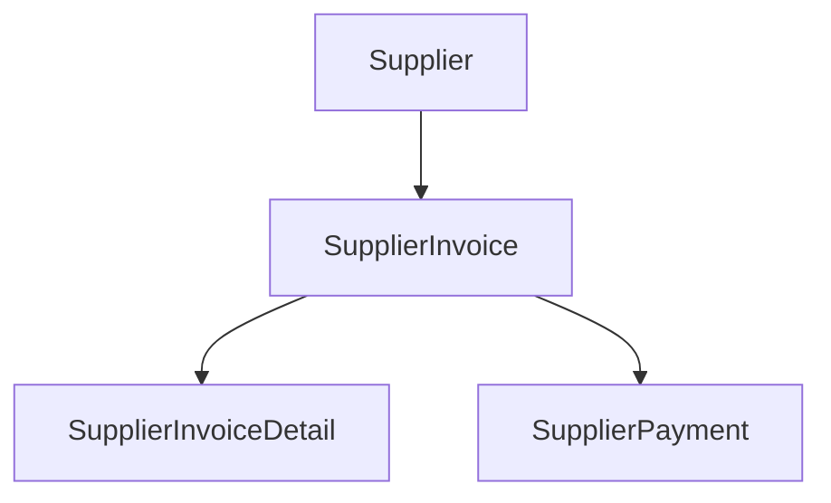
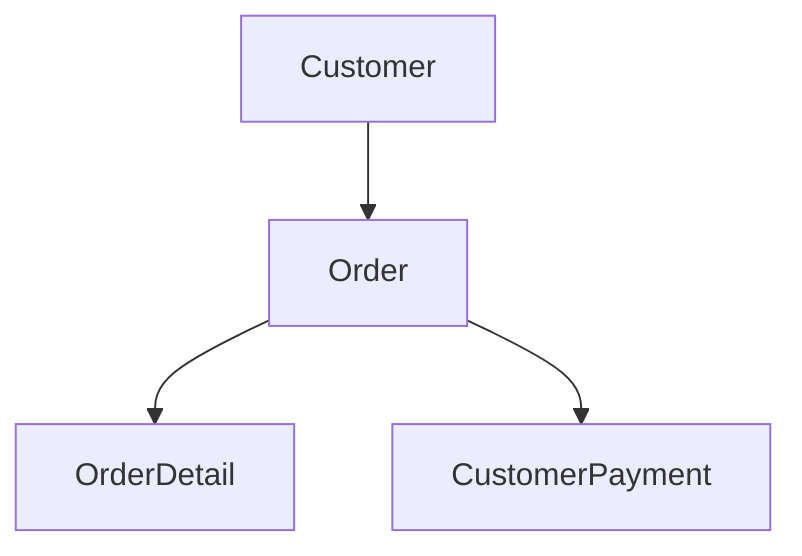

# bookx

Bookkeeping demo on the [Northwind](https://github.com/jpwhite3/northwind-SQLite3) 

## Accounting extensions

AR/AP tables on top of Northwind: `CustomerPayment`, `SupplierInvoice`, `SupplierInvoiceDetail`, `SupplierPayment`.

## Stack

[React Router](https://reactrouter.com/) · [Cloudflare D1](https://developers.cloudflare.com/d1/) · [SST](https://sst.dev/)
