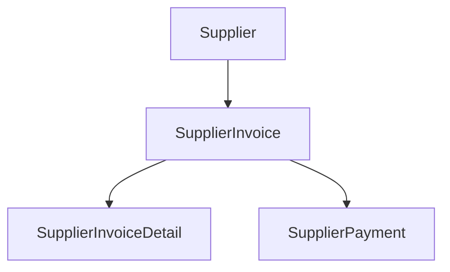
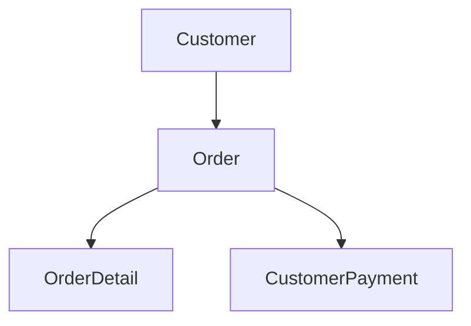

# bookx

book keeping example on northwind database

### Extending Dataset
extending the dataset to add full accounting cycle:
- CustomerPayment
- SupplierInvoice
- SupplierInvoiceDetail
- SupplierPayment

### Account Payables (AP)

### Account Receivables (AR)

